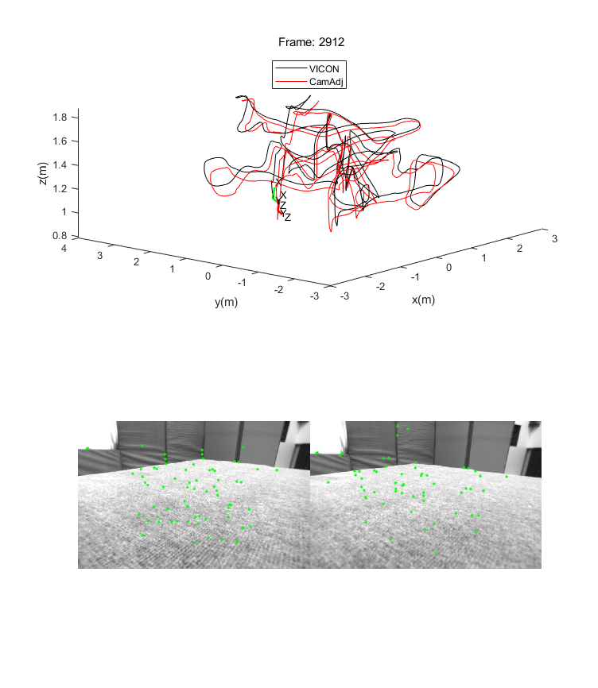
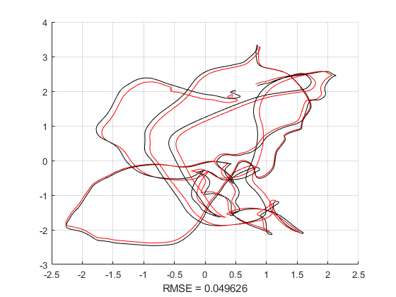

# CamAdj

We provided the necessary details to conduct and understand the demo code provided along with this supplementary document. The folder structure is give in follow:
````
.\Matlab code
   \CamAdjETH3D
	\datasets 				# we provide sampled data, more data can be download from: https://www.eth3d.net/datasets
	\functions
	\results
	outlierFiltration.m 			# run this script for paper Tab.I
  	poseEstimationFor3rdView.m 		# run this for paper Tab.II and Fig. 6
	twoView3DReconstruction.m		# paper Section VI.A  
	twoViewPoseEstimation.m			# paper Section VI.B 

   \CamAdjEuRoC
	\euroc					# please download rosbag from the EuRoC MAV dataset: https://projects.asl.ethz.ch/datasets/doku.php?id=kmavvisualinertialdatasets
	\functions
	euroc_demo.m				# run this script for paper Section VI.C
````

# Example

Run "euroc_demo.m" in \CamAdjEuRoC, you will see the following results:

